# Purple Team Attack & Detection Lab

<h2> Description</h2>

<b>This project simulates a cyberattack using Kali Linux and detects malicious activity using Splunk SIEM and Sysmon logs.</b>

In this project:
<ol>
  <li>Launch Attack</li>
  <li>Collect Logs</li>
  <li>Detect suspicious activity</li>
  <li>Investigate the attack</li>
</ol>

<h2>Tools Used</h2>
<table>
  <tr>
    <th>Tool</th>
    <th>Purpose</th>
  </tr>
  <tr>
    <td>Virtual Box</td>
    <td>Run Virtual Machines</td>
  </tr>
    <tr>
    <td>Kali Linux</td>
    <td>Attack Machine</td>
  </tr>
    <tr>
    <td>Windows 11 VM</td>
    <td>Victim Machine</td>
  </tr>
    <tr>
    <td>Splunk</td>
    <td>Log Analysis</td>
  </tr>
    <tr>
    <td>Sysmon</td>
    <td>Detailed Windows Logging</td>
  </tr>
    <tr>
    <td>Nmap</td>
    <td>Reconnaissance</td>
  </tr>
    <tr>
    <td>Metasploit</td>
    <td>Exploitation</td>
  </tr>
</table>

<h2>Virtualization</h2>

For this project, I am utilizing Virtual Box. Virtual Box gives us the opportunity to run multiple machines in a sandbox environment. We can create Windows hosts, Linux hosts, etc. to create a lab environment for malware testing and learning tools safely. It is a great tool to use for simulating real threats and defending against them without causing harm to real systems.

I downloaded and installed Virtual Box on my machine to start creating my test machines and environment.

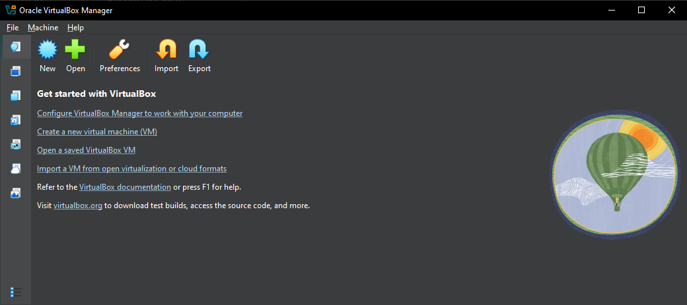

<h2>Create Lab Machines</h2>

  <h4>Machine 1: Attacker</h4>
  
  <table>
      <tr>
        <th>OS</th>
        <th>Purpose</th>
      </tr>
      <tr>
        <td>Kali Linux</td>
        <td>Simulate cyberattacks</td>
      </tr>
  </table>

  
Kali is a popular and powerful operating system built on Linux. It is primarily used for penetration testing offering a plethora of tools built right in to the operating system. I will use this machine as the "attacker" machine to simulate actual attacks like any enterprise could face in the real world.

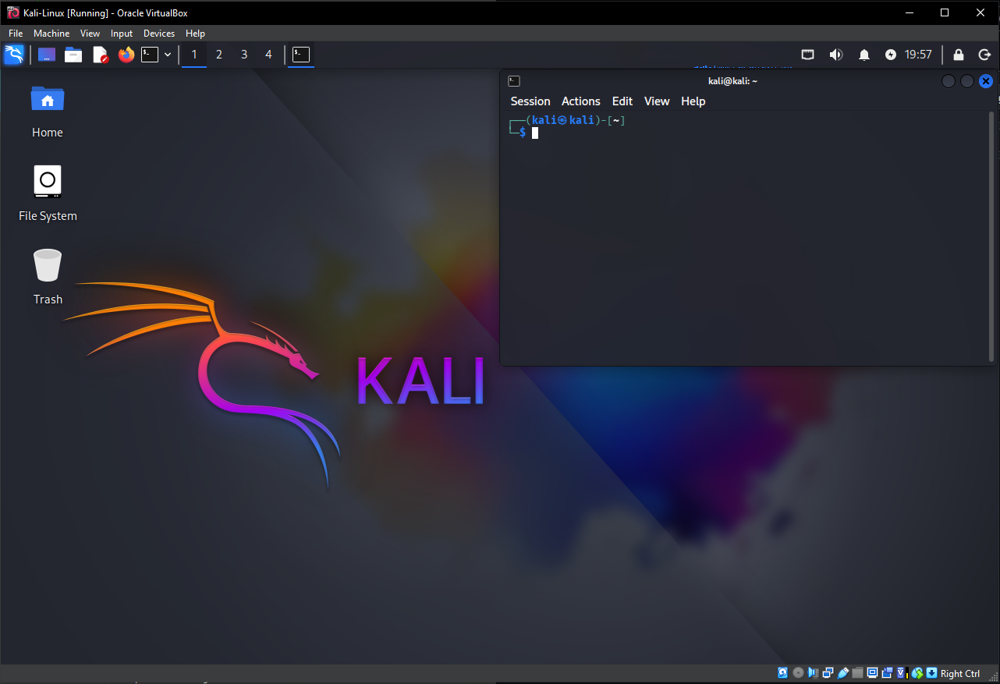
    
  <h4>Machine 2: Victim</h4>

  <table>
      <tr>
        <th>OS</th>
        <th>Purpose</th>
      </tr>
      <tr>
        <td>Windows 11</td>
        <td>Generate logs from attack</td>
      </tr>
  </table>

  
The victim machine is a Windows 11 host. Windows is the most common operating system in the world and is widely used in private corporations as well as government environments. Using Windows as a victim machine provides valuable insight to what most machines could experience during a cyberattack.

  
  
  <h4>Machine 3: SIEM</h4>

  <table>
      <tr>
        <th>OS</th>
        <th>Purpose</th>
      </tr>
      <tr>
        <td>Ubuntu Server</td>
        <td>Log collection and analysis</td>
      </tr>
  </table>

  
The machine I am using for a SIEM environment is Ubuntu. Ubuntu is one of the most popular LInux distros. It provides wide compatibility and a solid, reliable host for log ingestion. I will install Splunk on this machine for the SIEM.

  
  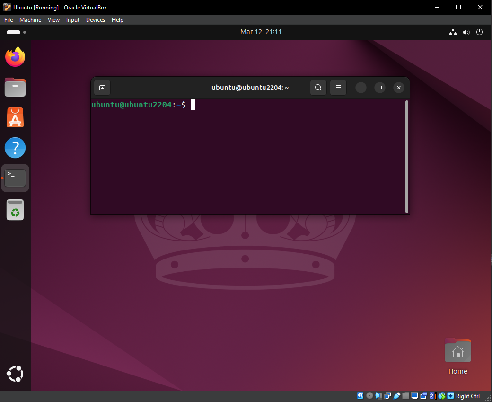
  
<h2>Configure the Network</h2>

Next step is to configure the network. Since we are testing, it is important to ensure the machines do not have internet access. Additionally, the machines are located in the same private subnet to allow communication with each other and nothing else, creating a sandbox environment. 

<h4>Machine 1: Attacker</h4>
  <table>
      <tr>
        <th>OS</th>
        <th>IP</th>
        <th>Subnet Mask</th>
      </tr>
      <tr>
        <td>Kali</td>
        <td>192.168.56.10</td>
        <td>255.255.255.0</td>
      </tr>
  </table>
  
 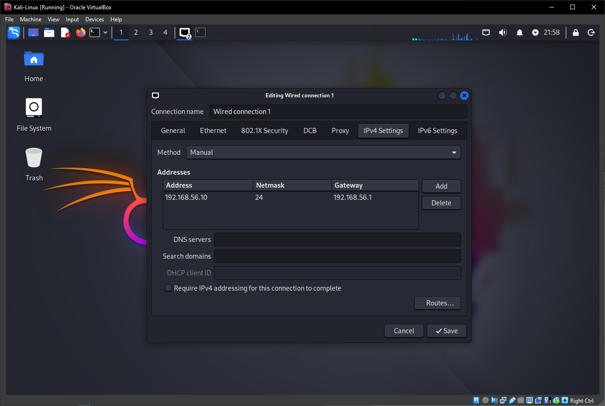
  
  
<h4>Machine 2: Victim</h4>
  <table>
      <tr>
        <th>OS</th>
        <th>IP</th>
        <th>Subnet Mask</th>
      </tr>
      <tr>
        <td>Windows 11</td>
        <td>192.168.56.20</td>
        <td>255.255.255.0</td>
      </tr>
  </table>

  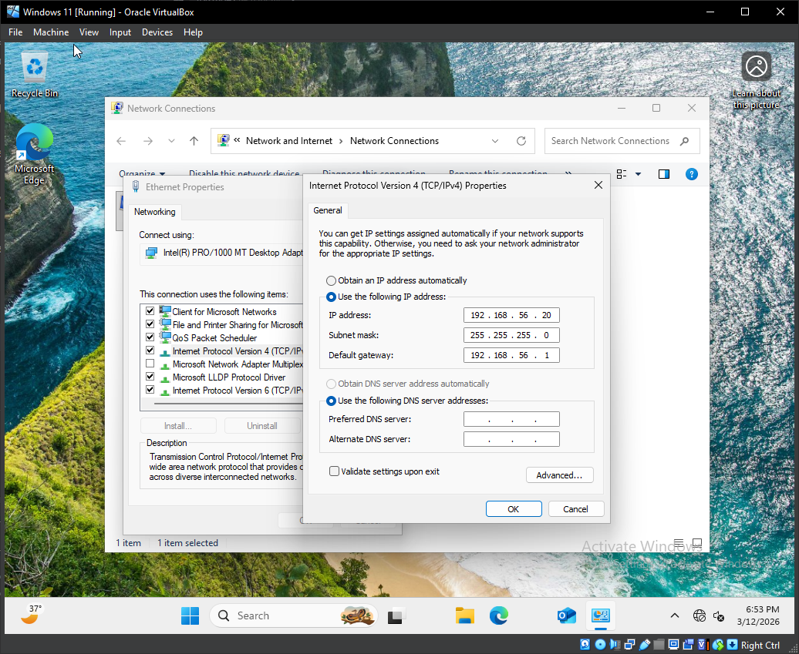

<h4>Machine 3: SIEM</h4>
  <table>
      <tr>
        <th>OS</th>
        <th>IP</th>
        <th>Subnet Mask</th>
      </tr>
      <tr>
        <td>Ubuntu</td>
        <td>192.168.56.30</td>
        <td>255.255.255.0</td>
      </tr>
  </table>

  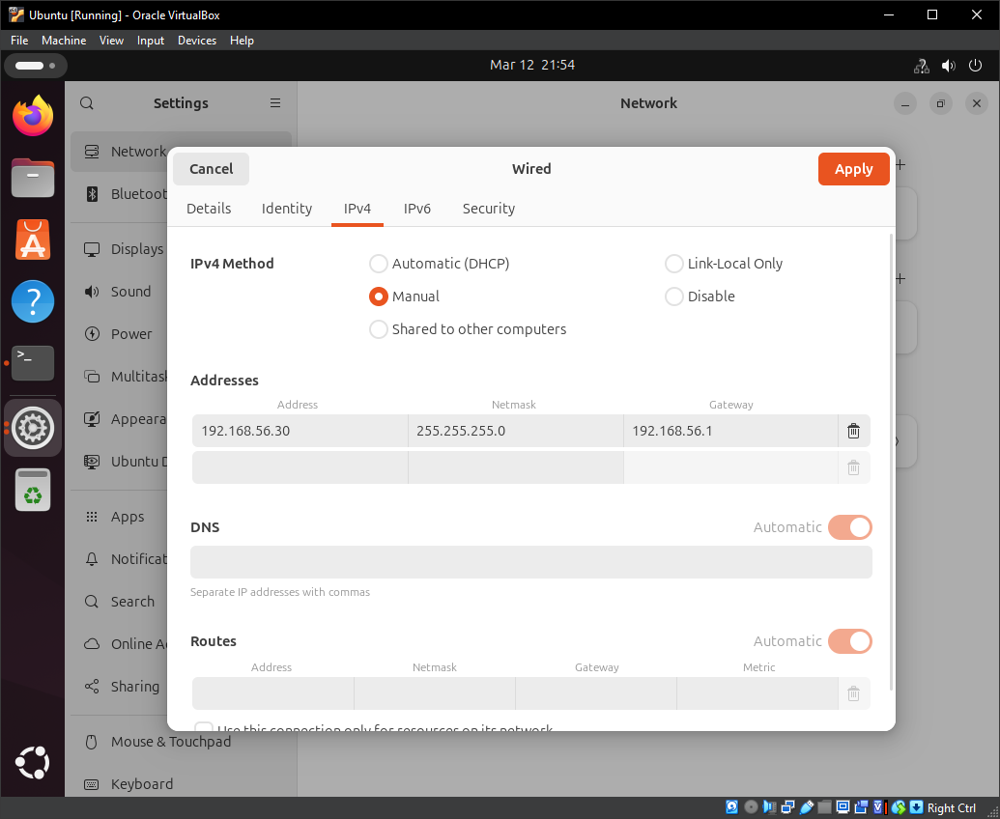

<h2>Testing and Verifying Network Connections</h2>

After the network settings have been set, first I ensured each device had the correct settings by issuing "ip a" on Linux machines and "ipconfig" on windows machine. Second, I ensured each device could communicate with each other via the "ping" command. Additional modifications needed to be done on the Windows firewall for ICMP communication.

Connection settings and testing were successful:
 

<h3>Kali Connection Test</h3>

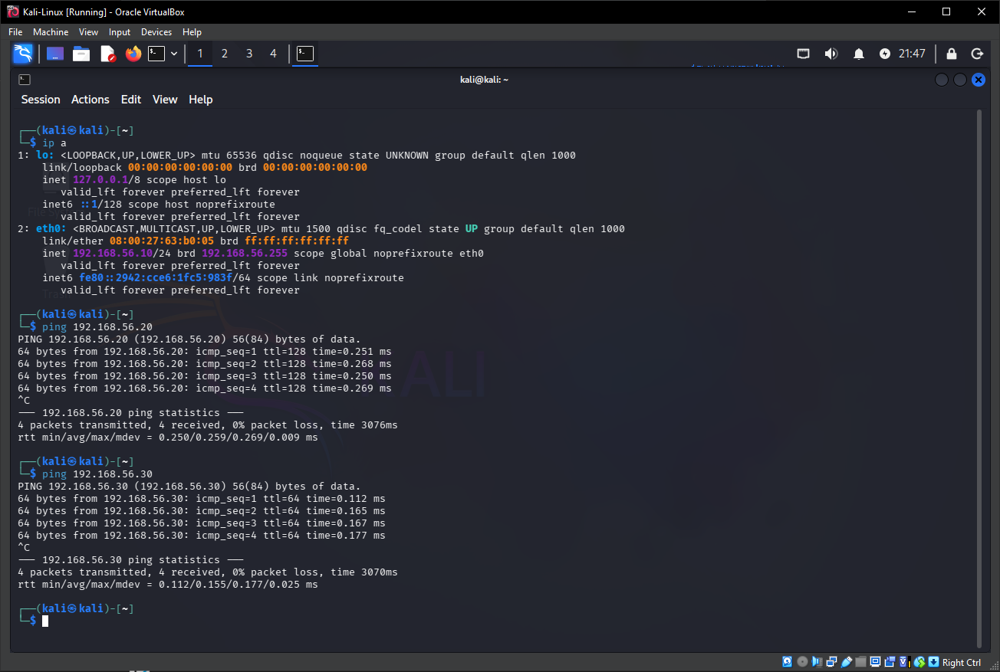 

<h3>Windows Connection Test</h3>

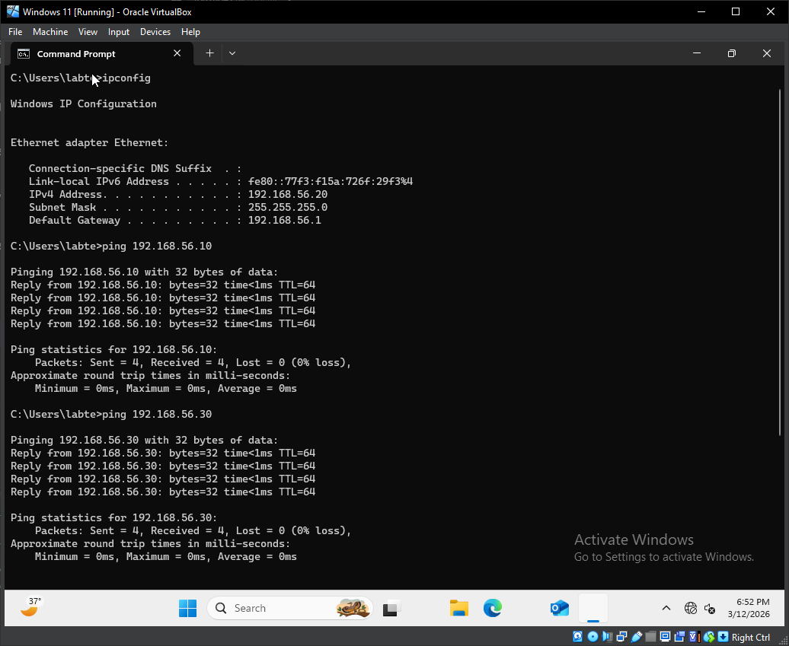

<h3>Ubuntu Connection Test</h3>

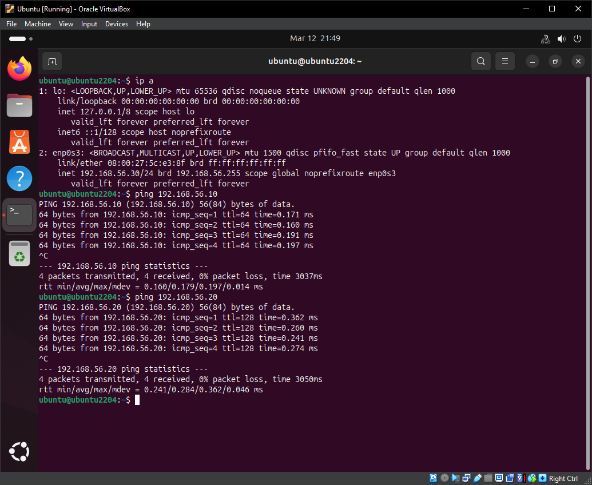

<h2>Install Sysmon on Windows</h2>

Sysmon is a Windows system service from Microsoft that logs detailed system activity to help detect malicious behavior on a computer. It is part of the Sysinternals Suite and is widely used by SOC analysts, threat hunters, and blue teams.

It records things Windows normally does not log in detail.

I installed Sysmon from Microsofts website and configured it to avoid excessive logs:

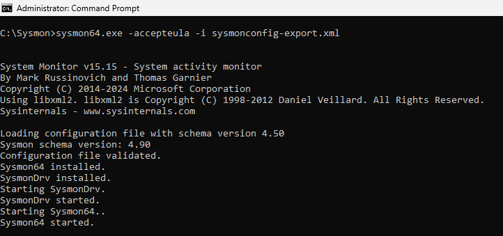

<h2>Verifying Logs Collection</h2>

Next, I verified logs were being ingested properly to Event Viewer via Sysmon:

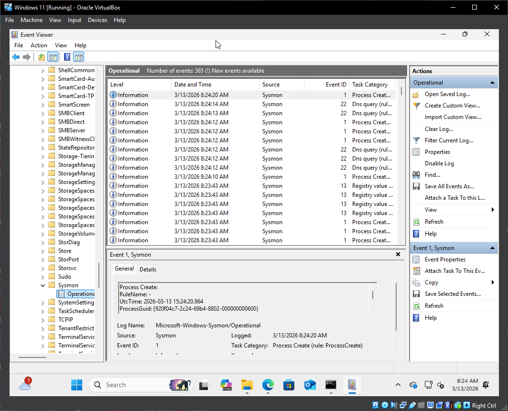

<h2>Install Splunk on Ubuntu</h2>

Splunk is a platform used to collect, search, analyze, and visualize machine data (logs) from systems, applications, and network devices.

In cybersecurity, Splunk is commonly used as a SIEM (Security Information and Event Management) system.

I installed Splunk using Ubuntu's Terminal which makes the process easy and fast:

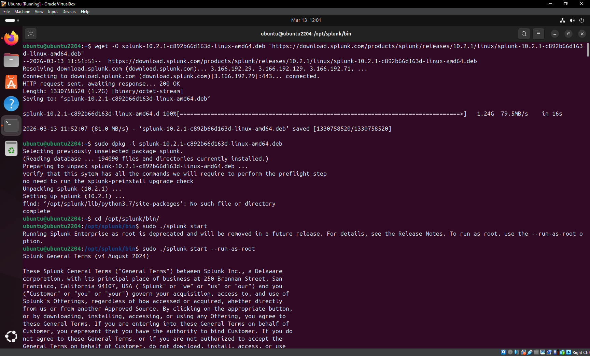

<h2>Verifying Splunk Functionality</h2>

Once Splunk was installed successfully. I navigated to the WebUI for Splunk to ensure it was working and accessible:

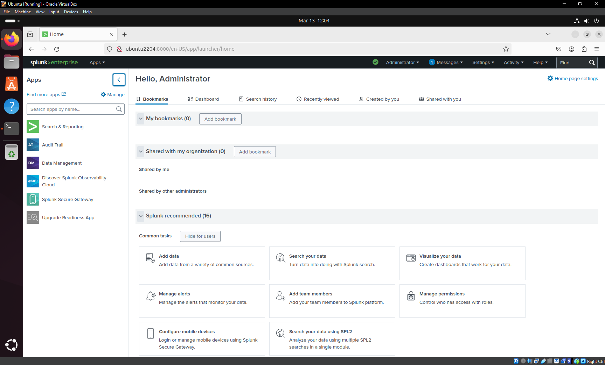

Test Splunk Search: Results indicate it is functioning as it should

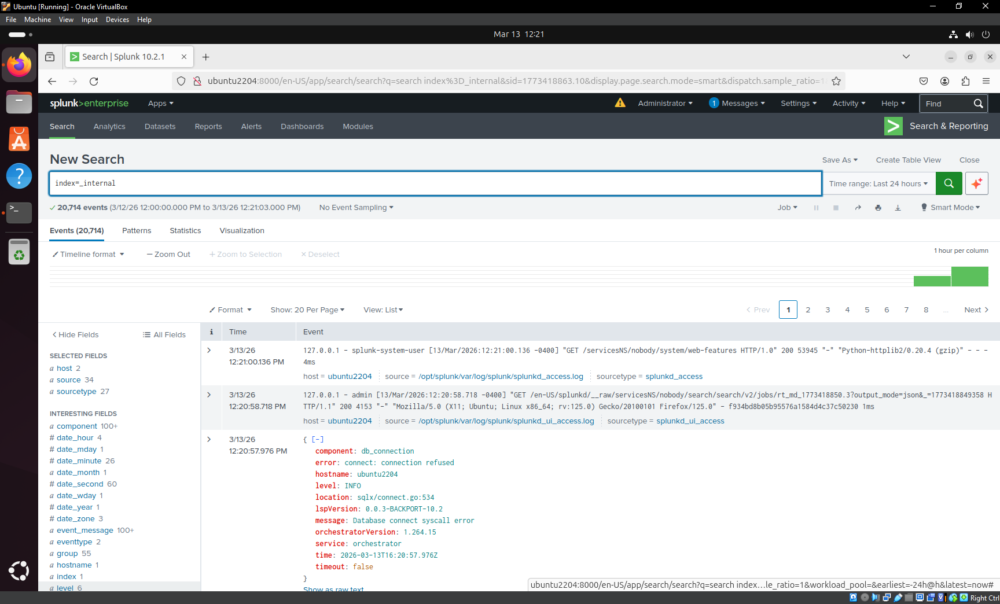

<h2>Send Windows Log to Splunk</h2>

<h3>Step 1</h3>

Installed Splunk Universal Forwarder and configured it to forward logs to 192.168.56.30:9997 (Ubuntu Splunk Server):

Configured receiving port in Splunk to listen on port 9997:

Verified Splunk is listening on correct ports:

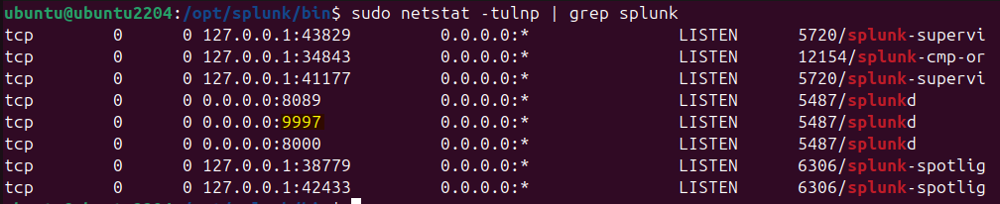

<h3>Step 2</h3>

Updated input configuration file (inputs.conf) to send windows events, sysmon, and firewall logs to Splunk:

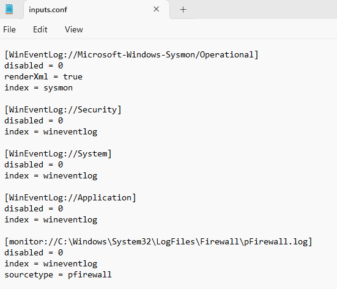

<h3>Step 3</h3>

Created indexes in Splunk to ingest logs in the correct location:

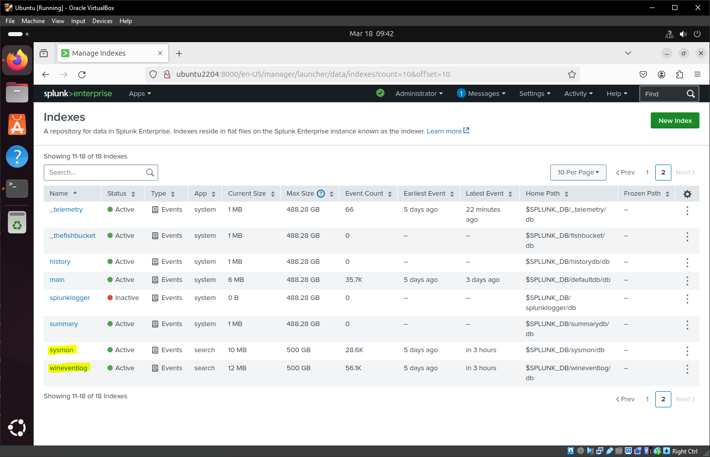

<h3>Step 4</h3>

Verified Splunk log ingestion

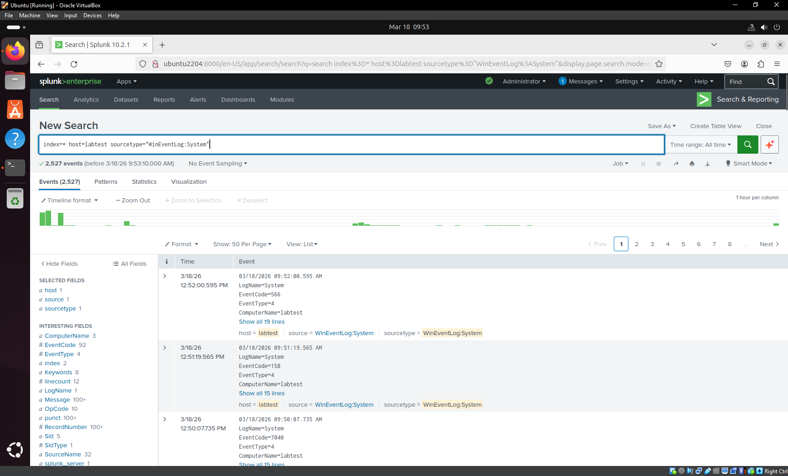

<h2>Perform Attacks (Red Team)</h2>
  <h4>Attack 1 - Network Scan</h4>
    <pre>
      <code>
        nmap -sS 192.168.56.20
      </code>
    </pre>
    
  <h4>Attack 2 - Brute Force Login</h4>
    <pre>
      <code>
        hydra -l administrator -P rockyou.txt smb://192.168.56.20
      </code>
    </pre>
    
  <h4>Attack 3 - Exploitation</h4>
      <pre>
      <code>
        msfconsole
      </code>
      <code>
        exploit/windows/smb/ms17_010_eternalblue    
      </code>
    </pre>
  
<h2>Detect Attacks (Blue Team)</h2>
  <h4>Detect Process Execution</h4>
  <h4>Detect Powershell Abuse</h4>
  <h4>Detect Network Connections</h4>
  <h4>Detect Suspicious Activity</h4>
  
<h2>Build a Detection Dashboard</h2>

<h2>Investigate the Attack</h2>
