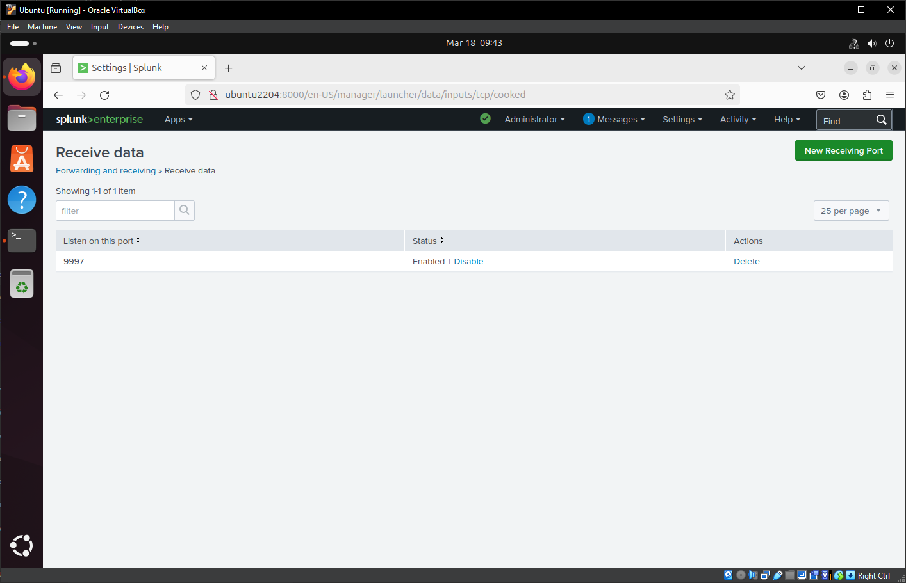
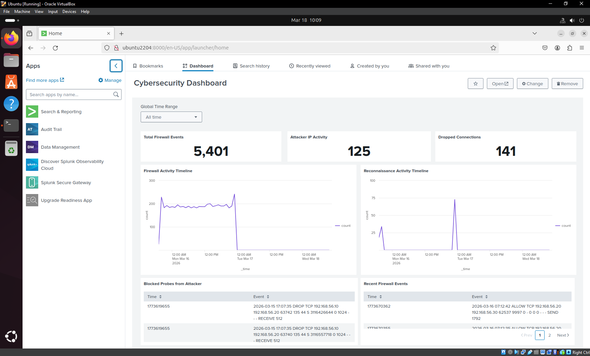
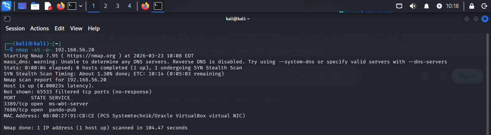
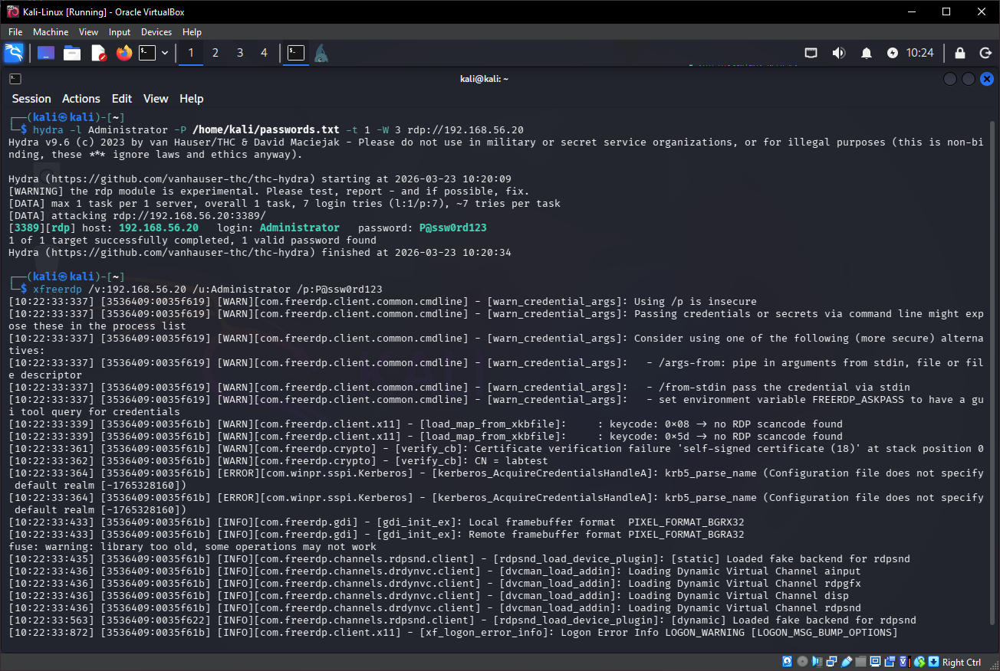
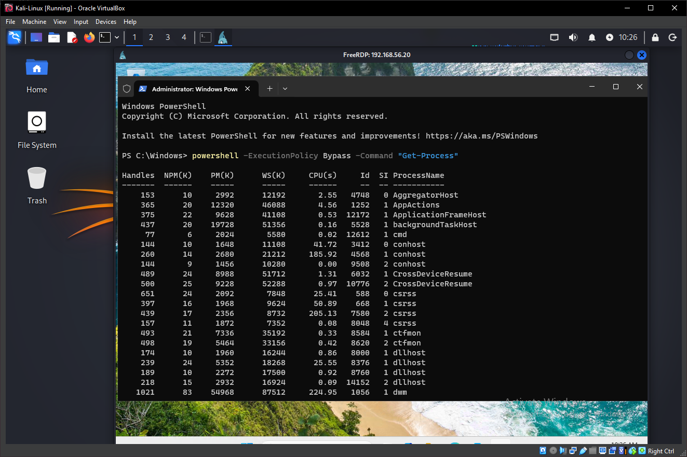
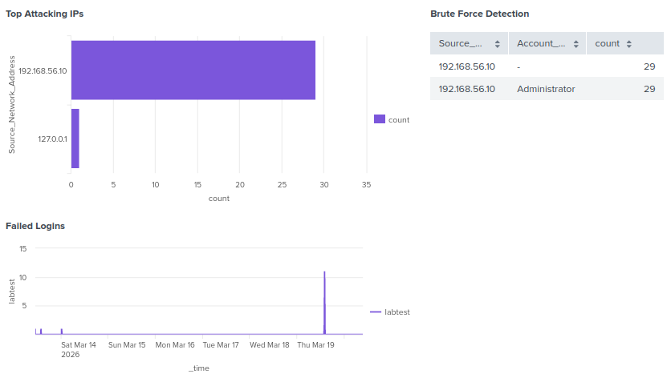
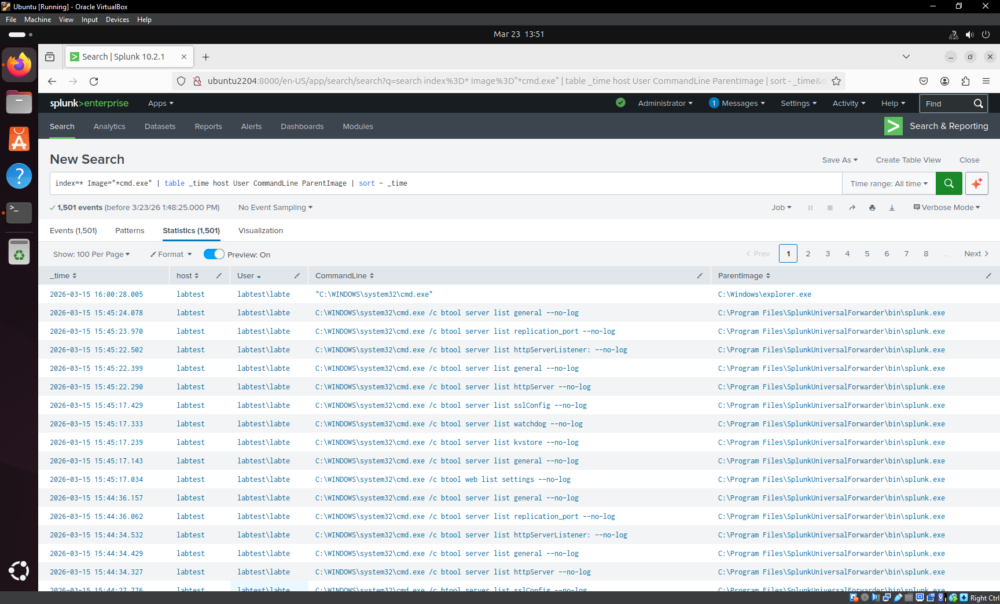
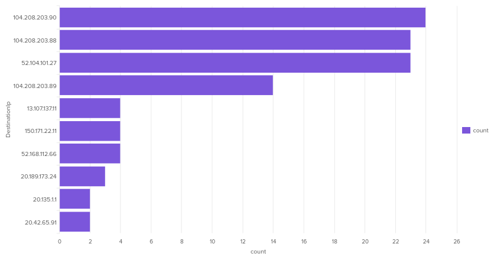
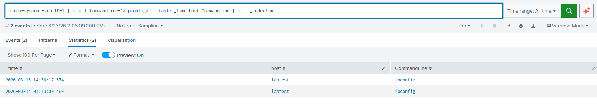

# Purple Team Attack & Detection Lab

<h2> Description</h2>

<b>This project simulates real-world cyber attacks and demonstrates how they can be detected using Splunk SIEM. The lab integrates both offensive (Kali Linux) and defensive (Windows + Sysmon + Splunk) components to replicate a realistic Security Operations Center (SOC) environment.</b>

In this project, I simulated a full attack chain:
<ol>
  <li>Reconnaissance using Nmap</li>
  <li>Brute force attack via RDP (Hydra)</li>
  <li>Successful login to the Windows system</li>
  <li>Post-exploitation using PowerShell and command execution</li>
  <li>Detection of all activity using Splunk Dashboards</li>
</ol>

All activity was monitored and detected using Splunk.

<h2>Tools Used</h2>
<table>
  <tr>
    <th>Tool</th>
    <th>Purpose</th>
  </tr>
  <tr>
    <td>Virtual Box</td>
    <td>Run Virtual Machines</td>
  </tr>
    <tr>
    <td>Kali Linux</td>
    <td>Attack Machine</td>
  </tr>
    <tr>
    <td>Windows 11 VM</td>
    <td>Victim Machine</td>
  </tr>
    <tr>
    <td>Splunk</td>
    <td>Log Analysis</td>
  </tr>
    <tr>
    <td>Sysmon</td>
    <td>Detailed Windows Logging</td>
  </tr>
    <tr>
    <td>Nmap</td>
    <td>Reconnaissance</td>
  </tr>
    <tr>
    <td>Hydra</td>
    <td>Brute Force/Dictionary Attack</td>
  </tr>
</table>

<h2>Virtualization</h2>

For this project, I am utilizing Virtual Box. Virtual Box gives us the opportunity to run multiple machines in a sandbox environment. We can create Windows hosts, Linux hosts, etc. to create a lab environment for malware testing and learning tools safely. It is a great tool to use for simulating real threats and defending against them without causing harm to real systems.

I downloaded and installed Virtual Box on my machine to start creating my test machines and environment.

<h2>Create Lab Machines</h2>

  <h4>Machine 1: Attacker</h4>
  
  <table>
      <tr>
        <th>OS</th>
        <th>Purpose</th>
      </tr>
      <tr>
        <td>Kali Linux</td>
        <td>Simulate cyberattacks</td>
      </tr>
  </table>

  
Kali is a popular and powerful operating system built on Linux. It is primarily used for penetration testing offering a plethora of tools built right in to the operating system. I will use this machine as the "attacker" machine to simulate actual attacks like any enterprise could face in the real world.

    
  <h4>Machine 2: Victim</h4>

  <table>
      <tr>
        <th>OS</th>
        <th>Purpose</th>
      </tr>
      <tr>
        <td>Windows 11</td>
        <td>Generate logs from attack</td>
      </tr>
  </table>

  
The victim machine is a Windows 11 host. Windows is the most common operating system in the world and is widely used in private corporations as well as government environments. Using Windows as a victim machine provides valuable insight to what most machines could experience during a cyberattack.

  
  
  <h4>Machine 3: SIEM</h4>

  <table>
      <tr>
        <th>OS</th>
        <th>Purpose</th>
      </tr>
      <tr>
        <td>Ubuntu Server</td>
        <td>Log collection and analysis</td>
      </tr>
  </table>

  
The machine I am using for a SIEM environment is Ubuntu. Ubuntu is one of the most popular LInux distros. It provides wide compatibility and a solid, reliable host for log ingestion. I will install Splunk on this machine for the SIEM.

  
  
  
<h2>Configure the Network</h2>

Next step is to configure the network. Since we are testing, it is important to ensure the machines do not have internet access. Additionally, the machines are located in the same private subnet to allow communication with each other and nothing else, creating a sandbox environment. 

<h4>Machine 1: Attacker</h4>
  <table>
      <tr>
        <th>OS</th>
        <th>IP</th>
        <th>Subnet Mask</th>
      </tr>
      <tr>
        <td>Kali</td>
        <td>192.168.56.10</td>
        <td>255.255.255.0</td>
      </tr>
  </table>
  
 
  
  
<h4>Machine 2: Victim</h4>
  <table>
      <tr>
        <th>OS</th>
        <th>IP</th>
        <th>Subnet Mask</th>
      </tr>
      <tr>
        <td>Windows 11</td>
        <td>192.168.56.20</td>
        <td>255.255.255.0</td>
      </tr>
  </table>

  

<h4>Machine 3: SIEM</h4>
  <table>
      <tr>
        <th>OS</th>
        <th>IP</th>
        <th>Subnet Mask</th>
      </tr>
      <tr>
        <td>Ubuntu</td>
        <td>192.168.56.30</td>
        <td>255.255.255.0</td>
      </tr>
  </table>

  

<h2>Testing and Verifying Network Connections</h2>

After the network settings have been set, first I ensured each device had the correct settings by issuing "ip a" on Linux machines and "ipconfig" on windows machine. Second, I ensured each device could communicate with each other via the "ping" command. Additional modifications needed to be done on the Windows firewall for ICMP communication.

Connection settings and testing were successful:
 

<h3>Kali Connection Test</h3>

 

<h3>Windows Connection Test</h3>

<h3>Ubuntu Connection Test</h3>

<h2>Install Sysmon on Windows</h2>

Sysmon is a Windows system service from Microsoft that logs detailed system activity to help detect malicious behavior on a computer. It is part of the Sysinternals Suite and is widely used by SOC analysts, threat hunters, and blue teams.

It records things Windows normally does not log in detail.

I installed Sysmon from Microsofts website and configured it to avoid excessive logs:

<h2>Verifying Logs Collection</h2>

Next, I verified logs were being ingested properly to Event Viewer via Sysmon:

<h2>Install Splunk on Ubuntu</h2>

Splunk is a platform used to collect, search, analyze, and visualize machine data (logs) from systems, applications, and network devices.

In cybersecurity, Splunk is commonly used as a SIEM (Security Information and Event Management) system.

I installed Splunk using Ubuntu's Terminal which makes the process easy and fast:

<h2>Verifying Splunk Functionality</h2>

Once Splunk was installed successfully. I navigated to the WebUI for Splunk to ensure it was working and accessible:

Test Splunk Search: Results indicate it is functioning as it should

<h2>Send Windows Log to Splunk</h2>

<h3>Step 1</h3>

Installed Splunk Universal Forwarder and configured it to forward logs to 192.168.56.30:9997 (Ubuntu Splunk Server):

Configured receiving port in Splunk to listen on port 9997:

Verified Splunk is listening on correct ports:

<h3>Step 2</h3>

Updated input configuration file (inputs.conf) to send windows events, sysmon, and firewall logs to Splunk:

<h3>Step 3</h3>

Created indexes in Splunk to ingest logs in the correct location:

<h3>Step 4</h3>

Verified Splunk log ingestion

<h2>Build a Detection Dashboard</h2>

I built a Splunk detection dashboard to identify reconnaissance activity from a Kali Linux attacker VM targeting a Windows system. The dashboard visualizes firewall telemetry including dropped connections, attacker activity timelines, and blocked probes associated with Nmap scanning.

Each panel was created using splunk queries:

Total Firewall Events: 
<code>index=* source="C:\\Windows\\System32\\LogFiles\\Firewall\\pfirewall.log" | stats count as total_firewall_events</code>

Dropped Connections: 
<code>index=* source="C:\\Windows\\System32\\LogFiles\\Firewall\\pfirewall.log" DROP | stats count as dropped_connections</code>

Attacker Activity: 
<code>index=* source="C:\\Windows\\System32\\LogFiles\\Firewall\\pfirewall.log" "192.168.56.10" | stats count as attacker_events</code>

Firewall Events Over Time: 
<code>index=* source="C:\\Windows\\System32\\LogFiles\\Firewall\\pfirewall.log" | timechart count</code>

Reconnaissance Activity Over Time: 
<code>index=* source="C:\\Windows\\System32\\LogFiles\\Firewall\\pfirewall.log" "192.168.56.10" | timechart count</code>

Blocked Probes from Kali: 
<code>index=* source="C:\\Windows\\System32\\LogFiles\\Firewall\\pfirewall.log" DROP "192.168.56.10" | table _time _raw | rename _time as Time _raw as Event | head 10</code>

Recent Firewall Events: 
<code>index=* source="C:\\Windows\\System32\\LogFiles\\Firewall\\pfirewall.log" | table _time _raw | head 15</code>

<h2>Perform Attacks (Red Team)</h2>
  
I simulated multiple attacks from my Kali machine to the victim Windows 11 machine. The attacks included port scanning, brute-force authentication, and command execution once the machine was compromised.

  
  
<b>Attack 1: Port Scanning</b> - Port scanning is a an easy way to scan a machine to see which ports are open and can be exploited. 
    
      nmap -sS -p- 192.168.56.20
    
  
  
  

  
<b>Attack 2: Brute Force Authentication + Gaining RDP Access</b> - Once I saw port 3389 was listening, I used Hydra (a network login cracker) to perform brute force authentication via dictionary attack from my precompiled password list. A password matched against my list and then I utilized xfree to RDP in to the machine with the matching login information. 
  
    
    hydra -l Administrator -P rockyou.txt rdp://192.168.56.20 -t 4
    
  
  
  

  
<b>Attack 3: Run Suspicious Activities</b> - Once connection was established, I opened and ran a command through powershell to simulate suspicious activities much like an attacker would do. Of course, an attacker would likely run this in the background without the user knowing! 
    
    powershell -ExecutionPolicy Bypass -Command "Get-Process"
    
  
  
  

  
  
  
<h2>Detect Attacks (Blue Team)</h2>

I used multiple Splunk queries to detect attacks and suspicious behaviors. Each query was also used to create a custom detection dashboard for quick detection, containment, and remediation. These detections were created from Sysmon and Windows logs that I forwarded from Windows machine to Splunk server.

  <h4>Detect Attacking IPs</h4>
    
I utilized the ingested logs from Windows Events (Event Code = 4625) to detect which IP addresses had failed logon attempts to my Windows machine. The dashboard shows brute force attempts via login failures.

    
Splunk Query:

    <code>index=wineventlog EventCode=4625 | stats count by Source_Network_Address | sort - count | head 10</code>  
     
    
Splunk:

    
I have included different types of panels to showcase viewing the same information multiple ways.

    
  
  
    
  <h4>Detect CommandLine Abuse and Obfuscation</h4>
    
This query focuses on showing if the command line was used and which commands were performed. The query can easily be tuned to detect common commands an attacker may use on a machine and in turn sending alerts to the SOC.

    
Splunk Query:

    <code>index=* Image="*cmd.exe" | table _time host User CommandLine ParentImage | sort - _time</code> 
     
    
Splunk:

    
  
  
  <h4>Detect Network Connections</h4>
    
This query focuses on network connections made by the machine to detect potentially harmful IPs. Because this is a lab environment, the IPs listed here are all reputable but it highlights any abnormal network behavior.

    
Splunk Query:

    <code>index=sysmon EventID=3 | stats count by DestinationIP | sort - count | head 10</code>  
     
    
Splunk:

    
  

    
  <h4>Detect Suspicious Activity</h4>
    
This query focuses on commands executed via command line to detect attacker behavior. For the lab environment, a simple ipconfig command was used once a brute force authentication succeeded and the attacker 
      gained RDP access to the machine.

    
Splunk Query:

    <code>index=sysmon EventID=1 | search CommandLine="*ipconfig*" | table _time host CommandLine | sort _indextime</code>  
     
    
Splunk:

    
  

<h2>Lessons Learned</h2>

This lab demonstrated how real-world attacks leave detectable traces across multiple log sources and how those traces can be correlated to identify compromise.

<h3>Key Takeaways</h3>
<ul>
  <li>Developed a full understanding of how logs flow from endpoint systems (Windows) to a SIEM platform (Splunk) using a forwarder-based architecture.</li>
  <li>Learned how to distinguish between event time (_time) and index time (_indextime) and how this impacts real-time visibility in Splunk.</li>
  <li>Gained hands-on experience correlating multiple log sources (Sysmon + Windows Event Logs + Firewall Logs) to identify attacker behavior.</li>
  <li>Understood how attackers leverage native tools like PowerShell and command-line utilities to evade detection (Living-off-the-Land techniques).</li>
  <li>Learned how detection thresholds (e.g., port scan thresholds) impact visibility and can lead to false negatives if not tuned properly.</li>
</ul>

<h3>Skills Demonstrated</h3>
<ul>
  <li>SIEM configuration and management using Splunk.</li>
  <li>Log ingestion, parsing, and normalization</li>
  <li>Endpoint monitoring using Sysmon</li>
  <li>Detection engineering using SPL (Splunk Processing Language)</li>
  <li>Threat hunting and behavioral analysis</li>
  <li>Network traffic analysis and port scan detection</li>
  <li>Authentication monitoring and brute force detection</li>
  <li>Troubleshooting data ingestion, timestamp, and field extraction issues</li>
</ul>

<h3>Detection Engineering Insights</h3>
<ul>
  <li>Effective detections are behavior-based, not just signature-based</li>
  <li>Multiple log sources must be correlated to accurately detect attacks</li>
  <li>Field validation (e.g., identifying correct fields like IpAddress vs src_ip) is critical for accurate queries</li>
  <li>Detection logic must account for environmental differences (e.g., Sysmon vs Windows logs vs firewall logs)</li>
  <li>Visualization (dashboards) plays a key role in rapid triage and investigation</li>
</ul>

<h3>Challenges and Solutions</h3>
<ul>
  <li><b>Challenge:</b> Logs not appearing in real-time <b>Solution:</b> Identified differences between _time and _indextime and adjusted search time ranges</li>
  <li><b>Challenge:</b> Missing or incorrect fields in queries <b>Solution:</b> Used fieldsummary and raw event inspection to identify correct field names</li>
  <li><b>Challenge:</b> Port scan detection not triggering <b>Solution:</b> Adjusted thresholds and generated sufficient network activity to validate detection</li>
  <li><b>Challenge:</b> RDP brute force simulation issues <b>Solution:</b> Resolved account restrictions, firewall settings, and connection limitations</li>
</ul>

<h3>SOC Analyst Mindset Gained</h3>
<ul>
  <li>Learned to approach problems from both attacker and defender perspectives (Purple Team)</li>
  <li>Developed the ability to investigate events chronologically using timelines</li>
  <li>Focused on identifying patterns of behavior rather than isolated events</li>
  <li>Improved troubleshooting skills across networking, endpoint, and SIEM layers</li>
</ul>

<h3>Future Improvements</h3>
<ul>
  <li>Implement real-time alerting and automated response workflows</li>
  <li>Integrate additional telemetry sources (e.g., Zeek or Suricata) for network-level visibility</li>
  <li>Enhance detections using MITRE ATT&CK mapping</li>
  <li>Build more advanced correlation searches and risk-based alerting</li>
</ul>
